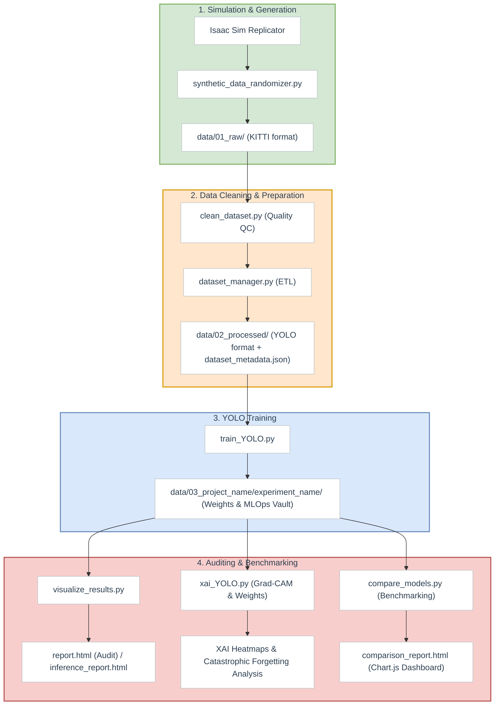

# 🚴‍♂️ Sim-to-Real-Isaac-Sim Pipeline

A complete, end-to-end synthetic data generation, training, and auditing pipeline leveraging **Nvidia Isaac Sim Replicator** and **YOLO architectures (v8, v9, v10, 11, 26)** to bridge the Sim-to-Real gap.

This project enables physics-aware domain randomized data generation, dataset cleaning, ETL processing, model training with MLOps metadata tracking, interactive HTML auditing reports, Explainable AI (XAI), and multi-model benchmarking dashboards.

---

## 📐 System Architecture

The following diagram illustrates the workflow of the unified pipeline, from Isaac Sim generation to model benchmarking and XAI:



---

## 📂 Project Structure

```text
.
├── src/
│   ├── core/                        # Core config, metadata builders & project utilities
│   │   ├── metadata/                # Metadata JSON builders for tracking runs
│   │   ├── utils/                   # Shared mathematical and project utilities
│   │   ├── config.py                # Global settings & constants
│   │   └── classes.txt              # Object class definitions
│   │
│   ├── simulation/                  # Synthetic generation module (runs in Isaac Sim)
│   │   ├── utils/                   # Asset managers & scene/physics-raycast utilities
│   │   └── synthetic_data_randomizer.py # Main simulation entry point
│   │
│   ├── data_prep/                   # Dataset ETL and Quality Control
│   │   ├── clean_dataset.py         # Filters corrupt, dark, or empty frames
│   │   └── dataset_manager.py       # Converts KITTI to YOLO & splits dataset
│   │
│   ├── training/                    # YOLO Training pipeline
│   │   └── train_YOLO.py            # Train, fine-tune and export to ONNX
│   │
│   └── evaluation/                  # Explainable AI & Auditing
│       ├── utils/                   # Report, HTML, and plot generators
│       ├── visualize_results.py     # Audits test datasets & runs real-world inference
│       ├── batch_auditor.py         # Automates evaluation of multiple models
│       ├── xai_YOLO.py              # Explainable AI (Grad-CAM & structural weight drift)
│       └── compare_models.py        # Multi-model Chart.js comparison tool
│
├── assets/                          # Simulation maps, USD files, and textures
├── data/                            # Central data directory
│   ├── 01_raw/                      # Raw simulation output (KITTI format)
│   ├── 02_processed/                # Cleaned and split YOLO dataset
|   ├── 03_project_name/             # Project saved experiments
|   │   ├── experiment_name/         # Experiment-specific data and models
|   │   └── ...
│   └── 05_metrics/                  # Evaluation metrics, reports and XAI outputs
└── templates/                       # HTML/CSS Jinja2 templates for reports
```

---

## 🛠️ Prerequisites & Installation

### Simulation Environment (Isaac Sim)
The simulation scripts must run inside the python environment bundled with **Nvidia Isaac Sim**.
* **Python**: Runs using Isaac Sim's bundled Python interpreter (usually `python.bat` or `./python.sh`).

### Training & Evaluation Environment
It is recommended to run training and evaluation in a separate standard Python environment (or Conda environment) to prevent dependency conflicts with Isaac Sim.

```bash
pip install ultralytics opencv-python matplotlib seaborn pandas pyyaml jinja2
```

---

## 🏃 Pipeline Workflow

### Step 1: Synthetic Data Generation
Generates synthetic frames using domain randomization (materials, lighting, camera perspectives, distractor placements) with physics-aware object placement.

```bash
# Executed via Isaac Sim's Python interpreter
C:\isaac-sim\python.bat .\src\simulation\synthetic_data_randomizer.py --headless --num_frames 100 --width 640 --height 480
```

* **CLI Arguments**:
  * `--num_frames`: Number of frames to generate (default: `1`)
  * `--width` / `--height`: Output image resolution (default: `1440x810`)
  * `--headless`: Runs without launching the Isaac Sim GUI editor (default: `False`)
  * `--data_dir`: Output storage folder (default: `data/01_raw`)

---

### Step 2: Data Cleaning & YOLO ETL
Before training, filter out bad frames (e.g., excessively dark or empty frames) and compile the data into YOLO format.

#### 1. Quality Control Cleaning
```bash
# Preview files to delete
python .\src\data_prep\clean_dataset.py --dir data/01_raw --dry

# Execute cleaning
python .\src\data_prep\clean_dataset.py --dir data/01_raw
```

#### 2. KITTI to YOLO Conversion & Splits
```bash
# Rebuild the dataset from scratch
python .\src\data_prep\dataset_manager.py

# Append new Isaac Sim frames to the existing dataset
python .\src\data_prep\dataset_manager.py --append
```

---

### Step 3: Model Training
Train or fine-tune YOLO models (v8, v9, v10, 11, 26). The script reads `classes.txt` to dynamically name the project folder.

```bash
# Interactive selection (YOLO version, size, experiment name)
python .\src\training\train_YOLO.py

# Custom duration & early stopping patience
python .\src\training\train_YOLO.py --epochs 100 --patience 15

# Fine-tune starting from an existing model
python .\src\training\train_YOLO.py --finetune --lr0 0.0001
```

> [!NOTE]
> Upon completion, a snapshot of both the dataset metadata and training metadata is archived into an MLOps vault inside the experiment directory.

---

### Step 4: Model Auditing & Visual Reports
Generate comprehensive, tabbed interactive HTML reports to evaluate model performance.

#### 🕵️ Audit Mode (Test Dataset with Labels)
```bash
# Find and export only errors (False Negatives, False Positives, etc.)
python .\src\evaluation\visualize_results.py

# Generate report.html with full visual diagnostics
python .\src\evaluation\visualize_results.py --draw_all
```

#### 🌍 Inference Mode (Real-world Unlabeled Images)
```bash
python .\src\evaluation\visualize_results.py --source /path/to/real_photos
```

#### 💾 Save Audits and Inferences permanently
```bash
python .\src\evaluation\visualize_results.py --draw_all --save
```

---

### Step 5: Multi-Model Benchmarking
Compare different training iterations side-by-side. This script launches an interactive CLI, scanning saved evaluations to build a Chart.js dashboard (`comparison_report.html`).

```bash
python .\src\evaluation\compare_models.py
```

---

### Step 6: Explainable AI (XAI)
Explain YOLO decisions using activation maps and examine model drift/catastrophic forgetting.

```bash
python .\src\evaluation\xai_YOLO.py
```
* **Options**:
  1. **Spatial XAI (Grad-CAM)**: Visualizes model focus layer-by-layer.
  2. **Structural XAI**: Computes weight drift, bias shifts, and sparsity relative to COCO base weights.
  3. **Full Suite**: Runs both automatically.

---

## 📈 Reports Overview

* **`report.html` (Audit)**: Details PR Curves, F1-scores, confidence distributions, and Sim-to-Real metadata.
* **`inference_report.html`**: Analyzes real-world predictions, crowdness heatmaps, and overlaps (IoU overlap anomalies).
* **`comparison_report.html`**: Grouped bar charts, trend lines, and training hyperparameter matrices comparing models.